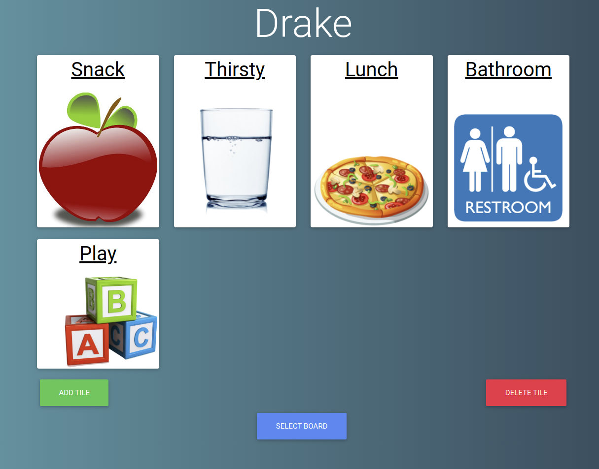

# Image to Speech Web Application
### I created an image to speech application. Each user can create and name different "boards." Each board contains a unique set of tiles. When a tile is clicked on, the word is read out loud. The intended audience is individuals who have difficulty speaking and writing. A caregiver would set up a board, and the user can click on tiles to communicate.
  

 ### The application was created using React, Bootstrap, HTML, and CSS. It was then deployed to github pages.

  

### You can test the website out at: https://drakecullen.github.io/image-to-speech/

 

### Here are some images of the website:

 

 

